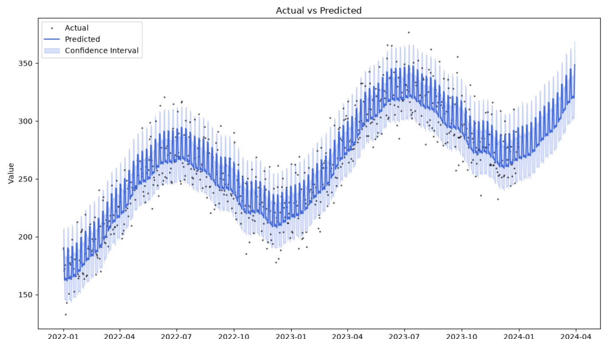

# 📈 Sales & Demand Forecasting Dashboard

A desktop application for time-series sales/demand forecasting, built with **Facebook/Meta Prophet**. Load your own sales data (or generate a realistic sample dataset), and get an interactive forecast with confidence intervals, plus a full trend/seasonality breakdown — no coding required to use it.



---

## Features

- **Two data sources**: use a built-in, realistically-generated sample sales dataset, or upload your own CSV (any date column + any value column — you choose which is which)
- **Prophet-powered forecasting**: automatically detects trend, weekly seasonality, and yearly seasonality
- **Actual vs Predicted view**: see how well the model fits historical data, with a shaded confidence interval band
- **Trend & Seasonality breakdown**: native Prophet component plots — see exactly *why* the model is forecasting what it's forecasting
- **Forecast table + CSV export**: get the numeric forecast (predicted value, lower bound, upper bound) and export it
- **Accuracy backtest**: MAE/RMSE computed on a held-out portion of your data, so the forecast isn't just a pretty picture — it's evaluated
- **Runs as a native desktop app** — no browser, no server, just double-click and use

---

## Tech Stack

| Component | Tool |
|---|---|
| Forecasting model | [Prophet](https://facebook.github.io/prophet/) (Meta/Facebook) |
| GUI | Python (Tkinter) |
| Data handling | pandas, numpy |
| Plotting | matplotlib |
| Packaging | PyInstaller (standalone `.exe`) |

---

## How It Works

Prophet decomposes a time series into three components:

```
forecast = trend + weekly seasonality + yearly seasonality + noise
```

- **Trend**: the long-term direction (growth, decline, or flat)
- **Weekly seasonality**: recurring patterns within a week (e.g. weekend spikes)
- **Yearly seasonality**: recurring patterns across a year (e.g. holiday-season bumps)
- **Confidence interval**: a plausible range for future values, not just a single number — it widens the further into the future you forecast, reflecting increasing uncertainty

This makes Prophet's output interpretable — you can see *why* it predicts what it predicts, rather than trusting a black box.

---

## Installation

### Option 1 — Download the app (Windows, no Python required)

1. Go to the [Releases](../../releases) page of this repository
2. Download `SalesForecastingDashboard.zip` from the latest release
3. Extract the zip
4. Double-click `desktop_app.exe` inside the extracted folder

No installation, no dependencies — it just runs.

> **Note:** Since this app isn't signed with a paid Windows code-signing certificate, Windows SmartScreen may show a warning ("Windows protected your PC"). This is expected for independently-built apps — click **"More info" → "Run anyway"** to proceed. The app is open-source; you can review the full code in this repo.

### Option 2 — Run from source (any OS)

```bash
git clone https://github.com/<your-username>/sales-forecasting-dashboard.git
cd sales-forecasting-dashboard
pip install -r requirements.txt
python desktop_app.py
```

---

## Usage

1. Click **"Use Sample Data"** to try it instantly with a generated dataset, or **"Upload CSV"** to use your own data
2. If uploading, select which column is the date and which is the value
3. Set the number of days to forecast
4. Click **"Run Forecast"**
5. Explore the tabs:
   - **Input Data** — preview of what was loaded
   - **Actual vs Predicted** — historical fit with confidence band
   - **Trend & Seasonality** — component breakdown
   - **Forecast Table** — exact numbers, exportable to CSV

---

## Project Structure

```
sales-forecasting-dashboard/
├── desktop_app.py          # Main application (Tkinter GUI + Prophet logic)
├── requirements.txt        # Python dependencies
├── sample_test_data.csv    # Sample CSV with a declining trend, for testing uploads
├── assets/                 # Screenshots used in this README
└── README.md
```

---

## Building the Executable Yourself

```bash
pip install pyinstaller
pyinstaller --onedir --windowed --collect-all prophet --collect-all cmdstanpy --collect-all holidays --collect-all matplotlib --hidden-import matplotlib.backends.backend_tkagg desktop_app.py
```

The output will be in `dist/desktop_app/`.

---

## Why Prophet (and not LSTM)?

Prophet was chosen deliberately over deep-learning approaches like LSTM because:
- It's designed for exactly this kind of business time-series problem, and is used in production forecasting pipelines at scale
- It requires far less data to produce reliable forecasts
- It's interpretable — trend and seasonality are exposed directly, not hidden inside a black box
- It handles messy real-world data (missing dates, outliers) gracefully out of the box

---

## License

This project is open-source under the MIT License.
